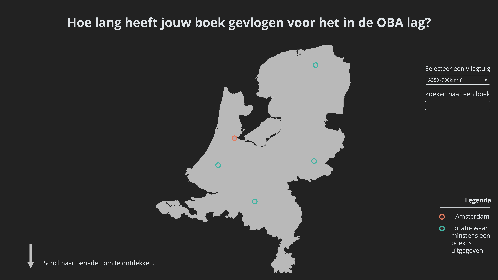
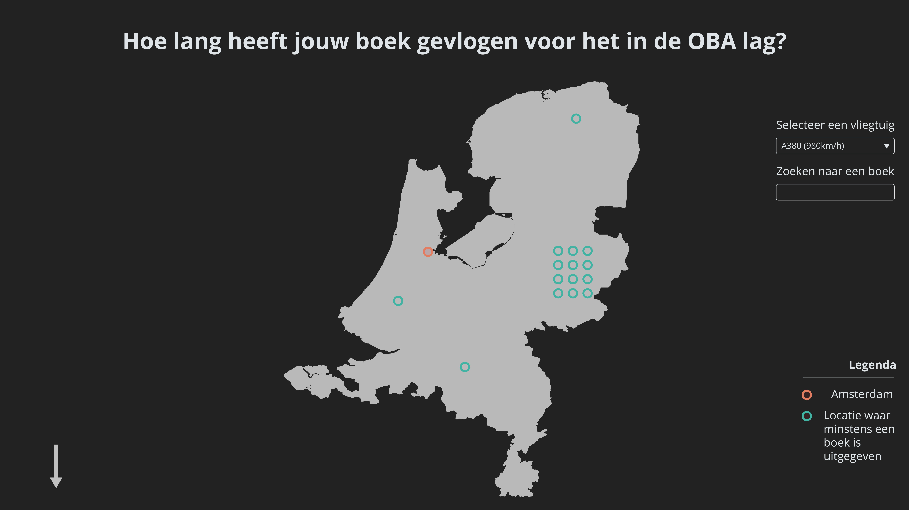
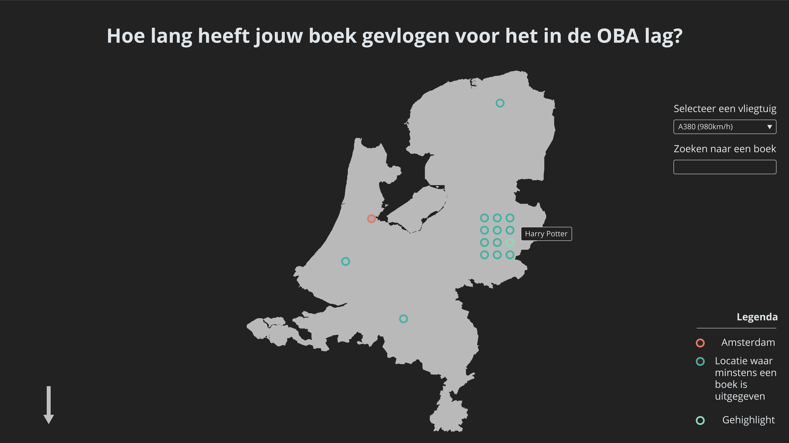
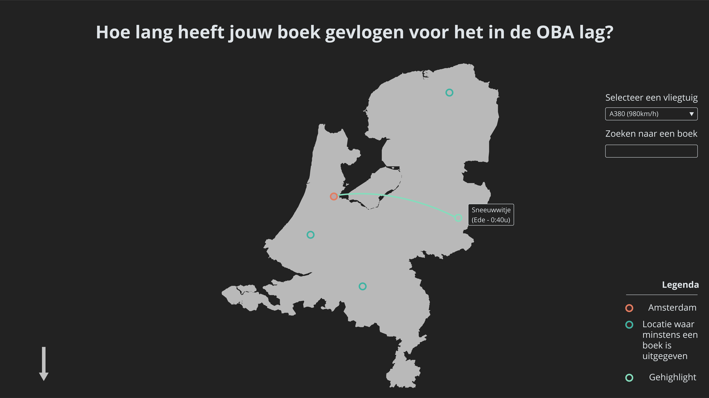
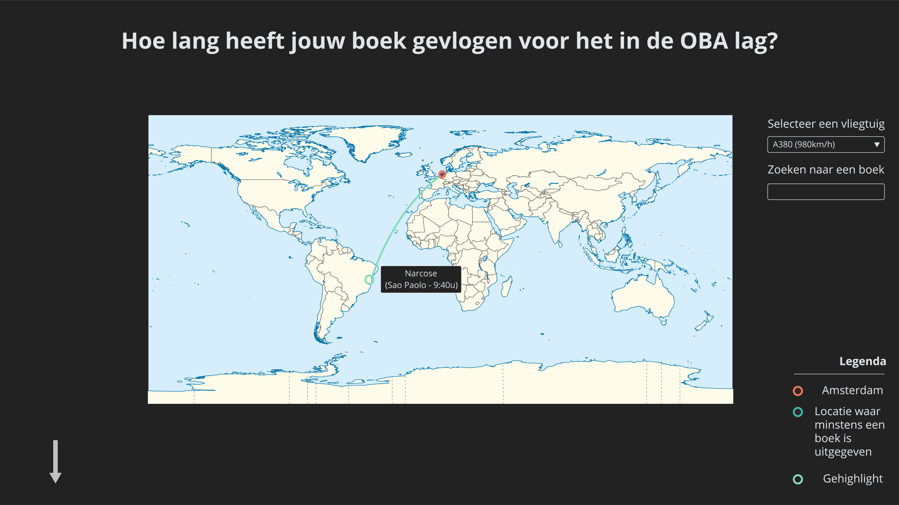

# Frontend Data

## Table of contents

* [Installation](#Installation)
* [Concept](#Concept)
    * [Future enhancements](#Future-enhancements)
* [Process](#Process)
* [Development](#Development)
    * [Tools](#Tools)
* [Honourable mentions](#Honourable-mentions)
* [Sources](#Sources)
* [License](#License)

## Installation

```bash
git clone git@github.com:Maikxx/frontend-data.git
cd frontend-data
```

1. Install the dependencies with: `yarn` or `npm install`.
2. Copy the _.env.example_ file with `cp .env.example .env` and provide the API keys.
3. Run the _development server_ with (**Warning: Don't do this on celular**) `yarn serve` or `npm run serve`.
4. Start _linting_ with `yarn lint` or `npm run lint`.

## Concept

<!-- TODO: add detailed description per image -->







### Future enhancements

* Implement search functionality.

## Process

<!-- TODO: Summary -->

The full log of my process can be found [here](docs/PROCESS.md)!

## Development

### Tools

* [Nodemon](https://nodemon.io)
* [TypeScript](https://www.typescriptlang.org)
* [Yarn](https://yarnpkg.com/en/)
* [JSON To TS](http://www.jsontots.com)

### API's

* [LocationIQ](https://locationiq.com/docs)
* [MaxBox](https://www.mapbox.com)

## Honourable mentions

* [Wouter](https://github.com/maanlamp):
    Wouter created the [boilerplate for pagination](https://github.com/maanlamp/node-oba-api-wrapper) with the OBA API.
* [Chelsea](https://github.com/chelseadoeleman):
    Chelsea helped me writing the data transformators and getting me up and running with D3.
* [Jessie](https://github.com/jessiemasonx):
    Jessie helped me getting up and running with D3.

## Sources

* Netherlands in the World.svg - Wikimedia Commons [Illustration]. (2011, April 11). Retrieved November 15, 2018, from https://commons.wikimedia.org/wiki/File:Netherlands_in_the_World.svg
* Spoon, S. (2009, February 3). Blank map of the Netherlands - Wikimedia Commons [Illustration]. Retrieved November 15, 2018, from https://commons.wikimedia.org/wiki/File:Blank_map_of_the_Netherlands.svg

## License

This repository is licensed as [MIT](LICENSE) by [Maikel van Veen](https://github.com/maikxx).